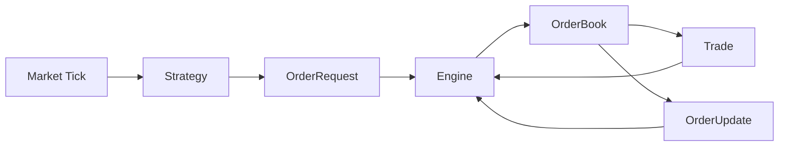

# Renaissance Backtest Engine

一个使用 Rust 构建的事件驱动交易回测与订单管理系统 mini 版。

当前项目重点是打通交易系统的同步核心链路：行情 tick 进入策略，策略生成订单请求，事件引擎将订单写入内存订单簿，价格交叉时生成成交和订单状态更新。

## Overview

Renaissance Backtest Engine 是一个面向交易基础设施建模的 Rust 项目。当前已经实现：

- 基础交易数据模型，例如 tick、订单、成交、订单更新；
- 基于买卖盘价格档位的内存限价订单簿；
- 简化版 price-time priority 撮合逻辑；
- 策略接口和一个阈值策略示例；
- 同步事件驱动引擎，将策略输出、订单簿状态和执行事件串联起来。

项目目前保持较小的实现范围，优先验证核心状态流转、订单簿行为和测试闭环。Tokio 异步运行时、行情回放、回测报告、API、日志、性能测试和持久化等能力仍处于规划阶段。

## Why This Project

这个项目的目标不是泛泛学习 Rust 语法，而是用 Rust 逐步构建一个性能敏感、状态严谨、事件驱动的交易系统基础设施。

它对应量化交易系统中的常见模块：

| 交易系统领域 | 当前或计划中的项目模块 |
| --- | --- |
| 行情数据 | `Tick` 模型，后续计划加入模拟行情和 CSV 回放 |
| 策略接口 | `Strategy` trait 和 `ThresholdStrategy` |
| 订单管理 | `OrderRequest`、`Order`、`OrderStatus`、`OrderUpdate` |
| 执行模拟 | `OrderBook` 撮合和 `Trade` 事件 |
| 事件驱动架构 | `Event` enum 和 `Engine` 处理流程 |
| 回测平台 | 后续计划加入历史回放、持仓、PnL 和报告层 |

Rust 适合这类项目，因为它能够用类型系统明确表达状态、所有权和错误路径，同时避免垃圾回收带来的运行时不确定性。

## Current Status

| 模块 | 状态 | 说明 |
| --- | --- | --- |
| 交易数据模型 | 已实现 | `Tick`、`OrderRequest`、`Order`、`OrderUpdate`、`Trade`、`Side`、`OrderStatus` |
| 事件模型 | 已实现 | `Event::{MarketTick, OrderRequest, OrderUpdate, Trade}` |
| 订单簿存储 | 已实现 | 买盘和卖盘使用 `BTreeMap<i64, Vec<Order>>` |
| 订单 ID 索引 | 已实现 | 使用 `HashMap<u64, OrderLocation>` |
| best bid / best ask | 已实现 | 查询最高买价和最低卖价 |
| spread | 已实现 | 双边存在时返回 `best_ask - best_bid` |
| depth | 已实现 | 按价格档位聚合数量和订单数 |
| add order | 已实现 | 支持重复订单 ID 拒绝 |
| cancel order | 已实现 | 从订单簿和索引中移除活跃订单 |
| order lookup | 已实现 | `contains_order` 和 `get_order` |
| matching | 已实现 | 支持价格交叉、部分成交、完全成交和连续撮合 |
| Strategy trait | 已实现 | 包含 `on_tick` 和 `on_order_update` hook |
| ThresholdStrategy | 已实现 | 用于测试系统链路的简单阈值策略 |
| Engine | 已实现 | 连接策略请求、订单簿写入、撮合和输出事件 |
| 单元测试 | 已实现 | 当前 40 个测试通过 |
| Tokio 异步事件循环 | 计划中 | 尚未实现 |
| 回测引擎 | 计划中 | 尚未实现 |
| HTTP API | 计划中 | 尚未实现 |
| 持久化 | 计划中 | 尚未实现 |
| benchmark | 计划中 | 尚未实现 |

当前二进制运行时会出现少量 Rust dead-code warning。原因是一些状态和接口已经提前建模，或仅在测试中使用，但尚未全部接入 `main` 示例流程。当前阶段的重点是核心建模、撮合逻辑和测试闭环。

## Architecture



当前同步流程：

1. `Tick` 传入 `Engine::process_market_tick`。
2. `Engine` 调用 `Strategy::on_tick`。
3. 策略返回零个或多个 `OrderRequest`。
4. `Engine` 分配订单 ID，并将请求转换为 `Order`。
5. `OrderBook` 存储订单，并尝试撮合已经交叉的买卖盘。
6. 撮合结果生成 `Trade` 和 `OrderUpdate` 事件。

当前实现是同步流程。Tokio task、channel 和异步事件循环属于后续计划。

## Core Concepts

| 概念 | 职责 |
| --- | --- |
| `Tick` | 行情输入，包含 symbol、price、quantity 和 timestamp |
| `OrderRequest` | 策略生成的订单意图，尚未分配订单 ID |
| `Order` | 进入订单簿后的活跃订单 |
| `OrderBook` | 内存买卖盘、订单索引和撮合逻辑 |
| `Trade` | 买卖订单成交后生成的执行结果 |
| `OrderUpdate` | 撮合后生成的订单状态和剩余数量更新 |
| `Event` | 系统内部事件枚举 |
| `Engine` | 协调策略输出、订单写入、撮合和事件输出 |
| `Strategy` | 将行情 tick 转换为订单请求的策略接口 |

## Project Structure

```text
.
├── Cargo.toml
├── README.md
└── src
    ├── main.rs
    ├── model.rs
    ├── event.rs
    ├── strategy.rs
    ├── engine.rs
    ├── engine
    │   └── tests.rs
    ├── order_book.rs
    └── order_book
        └── tests.rs
```

## Implemented Features

### Data Models

`src/model.rs` 定义交易系统的核心类型：

- `Side`：买卖方向；
- `OrderStatus`：新建、部分成交、完全成交、已取消、已拒绝；
- `Tick`：行情输入；
- `OrderRequest`：策略生成的订单请求；
- `Order`：订单簿内部订单；
- `OrderUpdate`：订单状态更新；
- `Trade`：买卖订单撮合后的成交记录。

`OrderRequest` 和 `Order` 被刻意分离。策略只表达交易意图，不负责分配订单 ID；订单 ID 由引擎统一生成。

### Order Book

`src/order_book.rs` 实现内存订单簿：

- 买盘和卖盘使用 `BTreeMap<i64, Vec<Order>>` 存储；
- 买盘按价格从高到低读取；
- 卖盘按价格从低到高读取；
- 同一价格档位内用 `Vec<Order>` 保持插入顺序；
- 使用 `HashMap<u64, OrderLocation>` 支持订单 ID 查询；
- `DepthLevel` 聚合价格、总数量和订单数；
- 重复订单 ID 会被拒绝。

当前支持的查询和操作：

- `add_order`；
- `cancel_order`；
- `best_bid`；
- `best_ask`；
- `spread`；
- `bid_depth`；
- `ask_depth`；
- `order_count`；
- `contains_order`；
- `get_order`；
- `best_bid_order`；
- `best_ask_order`。

### Matching Engine

订单簿支持简化撮合：

- 当 `best_bid >= best_ask` 时发生撮合；
- 当前成交价取卖盘价格；
- 成交数量取买卖双方剩余数量的较小值；
- 完全成交的订单会从订单簿和订单 ID 索引中移除；
- 部分成交的订单保留在订单簿中，并减少剩余数量；
- `match_orders` 会持续撮合，直到最优买卖价不再交叉。

这是用于当前阶段建模和测试的简化 price-time priority 实现，并不试图完整复刻生产级交易所撮合引擎。

### Strategy

`src/strategy.rs` 定义：

- `Strategy` trait，包含 `on_tick` 和 `on_order_update` hook；
- `ThresholdStrategy`，一个最小示例策略。

`ThresholdStrategy` 用于测试系统链路：

- 当价格小于等于 `buy_below` 时生成买单；
- 当价格大于等于 `sell_above` 时生成卖单；
- 忽略其他 symbol 的 tick；
- 当价格位于阈值区间内时不生成订单。

它是系统测试策略，不代表真实投资策略。

### Engine

`src/engine.rs` 连接事件、策略和订单簿：

- 通过 `handle_event` 处理 `Event::OrderRequest`；
- 分配递增订单 ID；
- 将订单写入订单簿；
- 重复撮合交叉订单；
- 输出 `Event::Trade` 和 `Event::OrderUpdate`；
- 暴露 `order_count`、`best_bid`、`best_ask` 等简单查询；
- 通过 `process_market_tick` 打通当前 tick -> strategy -> order book 流程。

## Getting Started

环境要求：

- Rust stable toolchain；
- Cargo。

运行示例：

```bash
cargo run
```

当前示例会创建一个阈值策略，输入一条 `BTCUSDT` tick，并打印输出事件和盘口状态。当前运行结果会得到一个挂在买盘上的订单，不会产生成交：

```text
output events: []
order count: 1
best bid: Some(98000)
best ask: None
```

运行测试：

```bash
cargo test
```

检查格式：

```bash
cargo fmt --check
```

## Testing

当前共有 40 个单元测试，覆盖：

- 数据模型行为和订单请求转换；
- 事件类型识别；
- 订单添加和重复订单 ID 拒绝；
- best bid / best ask 查询；
- spread 计算；
- bid / ask depth 聚合；
- 同价格档位 FIFO 行为；
- 撤单；
- 订单数量和订单 ID 查询；
- 价格交叉撮合；
- 部分成交和完全成交；
- 连续撮合直到价格不再交叉；
- 阈值策略行为；
- Engine 从订单请求到成交和订单更新的事件流；
- market tick 通过策略驱动订单簿。

当前本地验证结果：

```text
cargo test        # 40 passed
cargo fmt --check # passed
```

## Example Flow

一个简化场景：

1. 策略接收 `Tick`。
2. 策略生成 `OrderRequest`。
3. 引擎分配订单 ID，并创建 `Order`。
4. 订单簿存储订单。
5. 如果最优买价和最优卖价交叉，订单簿生成 `Trade`。
6. 引擎输出成交事件和对应的订单状态更新。

示例代码：

```rust
let mut engine = Engine::new();
let mut strategy = ThresholdStrategy::new(
    String::from("BTCUSDT"),
    99_000,
    101_000,
    1,
);

let tick = Tick {
    symbol: String::from("BTCUSDT"),
    price: 98_000,
    quantity: 1,
    timestamp: 1_717_000_000,
};

let events = engine.process_market_tick(&tick, &mut strategy)?;
```

在这个例子中，tick 价格低于买入阈值，因此策略生成买单请求。由于订单簿中没有卖单，该订单会停留在买盘，不会生成 `Trade` 事件。

## Roadmap

以下内容是后续计划，不是当前已完成能力：

- 行情模拟器；
- CSV tick 加载和历史行情回放；
- 基于 Tokio 的异步事件循环；
- 使用 channel 连接 market data、strategy 和 execution task；
- 回测引擎；
- portfolio / position 账户状态；
- fee、slippage 和 PnL 报告；
- Axum HTTP API，用于 orders、positions、backtests 和 metrics；
- 使用 `tracing` 进行结构化日志；
- 使用 Criterion 对订单簿插入、撤单、查询和撮合做 benchmark；
- 使用 SQLx / SQLite 做持久化；
- 随着运行时链路扩展，逐步清理当前 dead-code warning。

## Design Notes

- 使用 Rust 的 enum 和 struct 明确表达交易状态和事件类型。
- 使用 `Event` enum 统一建模行情、订单请求、成交和订单更新。
- 分离 `OrderRequest` 和 `Order`，避免策略层承担订单 ID 和引擎状态职责。
- 分离 `Trade` 和 `OrderUpdate`，因为成交事件和订单状态变化虽然相关，但语义不同。
- 使用 `BTreeMap` 保证价格档位的确定性排序。
- 使用 `HashMap` 支持按订单 ID 快速定位订单。
- 当前先实现同步版本，便于验证撮合正确性和状态流转；异步化会在核心逻辑稳定后引入。

## License

License: MIT，以 `Cargo.toml` 中声明为准。

仓库根目录当前没有独立的 `LICENSE` 文件。
