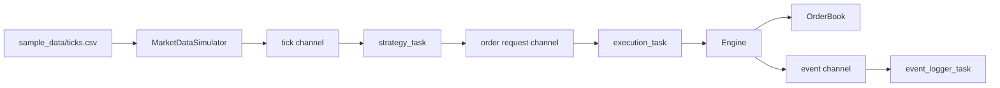
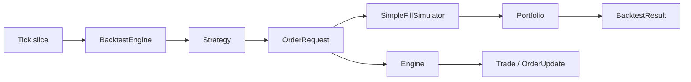

# Renaissance Backtest Engine

一个使用 Rust 构建的事件驱动交易回测与订单管理系统 mini 版。

当前项目已经具备一条完整的基础链路：CSV 或内存行情输入策略，策略生成订单请求，执行引擎写入内存订单簿并撮合成交，回测模块用简化成交模拟器更新账户、手续费、PnL、最大回撤和权益曲线。同时，项目也保留了 Tokio `mpsc` channel 版本的异步任务流水线，用于验证行情、策略、执行和事件日志之间的消息边界。

## Overview

Renaissance Backtest Engine 是一个面向交易基础设施建模的 Rust 项目。当前已经实现：

- 基础交易数据模型：`Tick`、`OrderRequest`、`Order`、`Trade`、`OrderUpdate`；
- 基于买卖盘价格档位的内存限价订单簿；
- 简化版 price-time priority 撮合逻辑；
- 事件引擎 `Engine`，负责订单生命周期和撮合事件输出；
- 策略接口 `Strategy` 以及 `ThresholdStrategy`、`DemoCrossStrategy` 示例策略；
- CSV 行情读取和内存行情回放；
- Tokio 异步任务流水线；
- 简化成交模拟器 `SimpleFillSimulator`；
- 账户模块 `Portfolio`，支持现金、持仓、手续费和权益计算；
- 回测模块 `BacktestEngine`，输出回测结果和基础指标。

项目仍保持较小实现范围，优先验证核心状态流转、订单簿行为、回测指标和测试闭环。HTTP API、持久化、结构化日志和 benchmark 暂未引入。

## Why This Project

这个项目的目标不是泛泛学习 Rust 语法，而是用 Rust 逐步构建一个状态严谨、事件驱动、可测试的交易系统基础设施。

| 交易系统领域 | 当前项目模块 |
| --- | --- |
| 行情数据 | `Tick`、`MarketDataSimulator`、CSV loader |
| 策略接口 | `Strategy`、`ThresholdStrategy`、`DemoCrossStrategy` |
| 订单管理 | `OrderRequest`、`Order`、`OrderStatus`、`OrderUpdate` |
| 撮合执行 | `OrderBook`、`Engine`、`Trade` |
| 异步消息通道 | `tasks.rs`、Tokio `mpsc` |
| 成交模拟 | `SimpleFillSimulator` |
| 账户状态 | `Portfolio`、现金、持仓、手续费、权益 |
| 回测平台 | `BacktestEngine`、`BacktestResult`、`EquityPoint`、基础指标 |

Rust 适合这类项目，因为它能够用类型系统明确表达状态、所有权和错误路径，同时避免垃圾回收带来的运行时不确定性。

## Current Status

| 模块 | 状态 | 说明 |
| --- | --- | --- |
| 交易数据模型 | 已实现 | `Tick`、`OrderRequest`、`Order`、`OrderUpdate`、`Trade`、`Side`、`OrderStatus` |
| 事件模型 | 已实现 | `Event::{MarketTick, OrderRequest, OrderUpdate, Trade}` |
| 订单簿存储 | 已实现 | 买盘和卖盘使用 `BTreeMap<i64, Vec<Order>>` |
| 订单 ID 索引 | 已实现 | 使用 `HashMap<u64, OrderLocation>` |
| best bid / best ask | 已实现 | 查询最高买价和最低卖价 |
| spread | 已实现 | 双边存在时返回 `best_ask - best_bid` |
| depth | 已实现 | 按价格档位聚合数量和订单数 |
| add / cancel order | 已实现 | 支持重复订单 ID 拒绝和活跃订单撤销 |
| order lookup | 已实现 | `contains_order` 和 `get_order` |
| matching | 已实现 | 支持价格交叉、部分成交、完全成交和连续撮合 |
| Strategy trait | 已实现 | 包含 `on_tick` 和 `on_order_update` hook |
| 示例策略 | 已实现 | `ThresholdStrategy`、`DemoCrossStrategy` |
| Engine | 已实现 | 连接订单请求、订单簿写入、撮合和输出事件 |
| MarketDataSimulator | 已实现 | 支持内存 tick、demo crossed ticks 和 CSV 文件读取 |
| Tokio 异步任务 | 已实现 | `market_data_task`、`strategy_task`、`execution_task`、`event_logger_task` |
| Fill simulator | 已实现 | 行情驱动的简化限价单成交模拟 |
| Portfolio | 已实现 | 现金、持仓、手续费、成交次数和 mark-to-market 权益 |
| BacktestEngine | 已实现 | tick 排序、策略执行、模拟成交、事件统计、权益曲线 |
| Backtest metrics | 已实现 | `final_equity`、`total_pnl`、`fee_paid`、`max_drawdown` |
| 单元测试 | 已实现 | 当前 71 个测试通过 |
| HTTP API | 计划中 | 尚未实现 |
| 持久化 | 计划中 | 尚未实现 |
| benchmark | 计划中 | 尚未实现 |

当前二进制运行时会出现少量 Rust dead-code warning。原因是一些状态和接口已经提前建模，或仅在测试和回测链路中使用，但尚未全部接入 `main` 示例流程。

## Architecture

异步 demo 流程：



回测流程：



## Core Concepts

| 概念 | 职责 |
| --- | --- |
| `Tick` | 行情输入，包含 symbol、price、quantity 和 timestamp |
| `OrderRequest` | 策略生成的订单意图，尚未分配订单 ID |
| `Order` | 进入订单簿后的活跃订单 |
| `OrderBook` | 内存买卖盘、订单索引和撮合逻辑 |
| `Trade` | 买卖订单成交后生成的执行结果 |
| `OrderUpdate` | 订单状态、已成交数量和剩余数量更新 |
| `Event` | 系统内部事件枚举 |
| `Engine` | 协调订单写入、撮合和事件输出 |
| `Strategy` | 将行情 tick 转换为订单请求的策略接口 |
| `MarketDataSimulator` | 从内存或 CSV 行情向 channel 推送 tick |
| `SimpleFillSimulator` | 在回测中根据 tick 判断订单是否成交 |
| `Portfolio` | 跟踪现金、持仓、手续费、成交次数和权益 |
| `BacktestEngine` | 运行策略回测并生成 `BacktestResult` |

## Project Structure

```text
.
├── Cargo.toml
├── README.md
├── sample_data
│   └── ticks.csv
└── src
    ├── main.rs
    ├── model.rs
    ├── event.rs
    ├── order_book.rs
    ├── order_book
    │   └── tests.rs
    ├── engine.rs
    ├── engine
    │   └── tests.rs
    ├── strategy.rs
    ├── market_data.rs
    ├── market_data
    │   └── tests.rs
    ├── tasks.rs
    ├── tasks
    │   └── tests.rs
    ├── fill_simulator.rs
    ├── portfolio.rs
    ├── portfolio
    │   └── tests.rs
    └── backtest
        ├── mod.rs
        ├── result.rs
        ├── metrics.rs
        └── tests.rs
```

## Implemented Features

### Data Models

`src/model.rs` 定义交易系统的核心类型：

- `Side`：买卖方向；
- `OrderStatus`：新建、部分成交、完全成交、已取消、已拒绝；
- `Tick`：行情输入；
- `OrderRequest`：策略生成的订单请求；
- `Order`：订单簿内部订单；
- `OrderUpdate`：订单状态更新；
- `Trade`：买卖订单撮合后的成交记录。

`OrderRequest` 和 `Order` 被刻意分离。策略只表达交易意图，不负责分配订单 ID；订单 ID 由引擎统一生成。

### Order Book

`src/order_book.rs` 实现内存订单簿：

- 买盘和卖盘使用 `BTreeMap<i64, Vec<Order>>` 存储；
- 买盘按价格从高到低读取；
- 卖盘按价格从低到高读取；
- 同一价格档位内用 `Vec<Order>` 保持插入顺序；
- 使用 `HashMap<u64, OrderLocation>` 支持订单 ID 查询；
- `DepthLevel` 聚合价格、总数量和订单数；
- 重复订单 ID 会被拒绝。

当前支持 `add_order`、`cancel_order`、`best_bid`、`best_ask`、`spread`、`bid_depth`、`ask_depth`、`order_count`、`contains_order`、`get_order`、`best_bid_order` 和 `best_ask_order`。

### Matching Engine

订单簿支持简化撮合：

- 当 `best_bid >= best_ask` 时发生撮合；
- 当前成交价取卖盘价格；
- 成交数量取买卖双方剩余数量的较小值；
- 完全成交的订单会从订单簿和订单 ID 索引中移除；
- 部分成交的订单保留在订单簿中，并减少剩余数量；
- `match_orders` 会持续撮合，直到最优买卖价不再交叉。

这是用于当前阶段建模和测试的简化 price-time priority 实现，并不试图完整复刻生产级交易所撮合引擎。

### Strategy

`src/strategy.rs` 定义：

- `Strategy` trait，包含 `on_tick` 和 `on_order_update` hook；
- `ThresholdStrategy`，一个最小阈值策略；
- `DemoCrossStrategy`，用于异步流水线和回测测试的交叉订单策略。

`ThresholdStrategy` 会在价格小于等于 `buy_below` 时生成买单，在价格大于等于 `sell_above` 时生成卖单，并忽略其他 symbol 的 tick。

`DemoCrossStrategy` 会在前两次 tick 中生成一笔买单和一笔交叉卖单，用于验证 task pipeline、撮合事件和回测统计。

### Engine

`src/engine.rs` 连接事件和订单簿：

- 通过 `handle_event` 处理 `Event::OrderRequest`；
- 分配递增订单 ID；
- 将订单写入订单簿；
- 重复撮合交叉订单；
- 输出 `Event::Trade` 和 `Event::OrderUpdate`；
- 暴露 `order_count`、`best_bid`、`best_ask` 等简单查询；
- 通过 `process_market_tick` 打通 tick -> strategy -> order book 流程。

### Market Data Simulator

`src/market_data.rs` 定义 `MarketDataSimulator`：

- 支持从内存 `Vec<Tick>` 创建模拟器；
- 提供 `demo_cross_ticks`，生成两条可以驱动交叉成交的示例 tick；
- 支持从 CSV 文件读取 tick；
- CSV header 要求为 `timestamp,symbol,price,quantity`；
- 通过 async `run` 方法将 tick 发送到 channel；
- 提供 `len` 和 `is_empty` 用于测试和状态检查。

### Async Tasks

`src/tasks.rs` 定义当前 Tokio 异步流水线：

- `market_data_task`：运行行情模拟器，将 `Tick` 发送到 tick channel；
- `strategy_task`：接收 tick，调用策略，并将 `OrderRequest` 发送到 order channel；
- `execution_task`：接收订单请求，调用 `Engine` 和 `OrderBook`，并发送输出事件；
- `event_logger_task`：接收并打印 `Trade` / `OrderUpdate` 等事件。

当前 channel 使用 Tokio `mpsc`，用于验证任务拆分和消息传递边界。尚未实现背压策略、错误恢复、graceful shutdown 信号或真实网络行情接入。

### Fill Simulator

`src/fill_simulator.rs` 定义 `SimpleFillSimulator`：

- symbol 不一致时不成交；
- buy limit 价格大于等于当前 tick 价格时成交；
- sell limit 价格小于等于当前 tick 价格时成交；
- 成交数量取订单数量和 tick 数量的较小值；
- 成交价格使用当前 tick 价格。

该模块用于回测账户侧的简化成交模拟，和订单簿撮合事件统计并行存在。

### Portfolio

`src/portfolio.rs` 定义 `Portfolio` 和 `Position`：

- 支持初始现金；
- buy fill 增加持仓并减少现金；
- sell fill 减少持仓并增加现金；
- 支持手续费；
- 记录手续费总额和账户侧成交次数；
- 支持按最后价格 mark-to-market 计算权益；
- 支持导出最终持仓数量。

### Backtest

`src/backtest/` 是回测模块：

- `mod.rs`：`BacktestEngine<S>` 主流程；
- `result.rs`：`BacktestResult` 和 `EquityPoint`；
- `metrics.rs`：手续费和最大回撤计算；
- `tests.rs`：回测模块测试。

`BacktestEngine::run` 会按 timestamp 排序 tick 引用，不 clone tick。每个 tick 会进入策略，策略订单同时进入：

- `SimpleFillSimulator` 和 `Portfolio`，用于账户现金、持仓、手续费和权益曲线；
- `Engine`，用于订单生命周期事件和成交事件统计。

`BacktestResult` 包含 tick 数、订单请求数、事件数、撮合成交数、订单更新数、模拟成交数、初始现金、最终现金、最终权益、总 PnL、手续费、最大回撤、权益曲线、账户成交数和最终持仓。

## Getting Started

环境要求：

- Rust stable toolchain；
- Cargo。

运行示例：

```bash
cargo run
```

当前 `main.rs` 会从 `sample_data/ticks.csv` 读取行情，启动四个 Tokio task：行情、策略、执行和事件日志。`DemoCrossStrategy` 会生成一笔买单和一笔交叉卖单，因此运行结果会打印订单请求、成交和订单更新。

运行测试：

```bash
cargo test
```

检查格式：

```bash
cargo fmt --check
```

## Example Flow

一个简化异步场景：

1. `MarketDataSimulator::from_csv_path("sample_data/ticks.csv")` 读取 tick。
2. `market_data_task` 将 tick 发送到 tick channel。
3. `strategy_task` 接收 tick，并通过 `DemoCrossStrategy` 生成订单请求。
4. `execution_task` 接收 `OrderRequest`。
5. `Engine` 分配订单 ID，并创建 `Order`。
6. `OrderBook` 存储订单。
7. 如果最优买价和最优卖价交叉，订单簿生成 `Trade`。
8. `event_logger_task` 接收成交事件和对应的订单状态更新。

示例代码：

```rust
let (tick_tx, tick_rx) = mpsc::channel::<Tick>(100);
let (order_tx, order_rx) = mpsc::channel::<OrderRequest>(100);
let (event_tx, event_rx) = mpsc::channel::<Event>(100);

let simulator = MarketDataSimulator::from_csv_path("sample_data/ticks.csv")?;
let strategy = DemoCrossStrategy::new();

let market_data_handle = tokio::spawn(market_data_task(simulator, tick_tx));
let strategy_handle = tokio::spawn(strategy_task(strategy, tick_rx, order_tx));
let execution_handle = tokio::spawn(execution_task(order_rx, event_tx));
let event_logger_handle = tokio::spawn(event_logger_task(event_rx));
```

在当前 demo 中，第一条 tick 生成买单，第二条 tick 生成交叉卖单。执行任务处理第二笔订单后，订单簿产生成交和对应的订单更新事件。

## Testing

当前共有 71 个单元测试，覆盖：

- 数据模型行为和订单请求转换；
- 事件类型识别；
- 订单添加和重复订单 ID 拒绝；
- best bid / best ask 查询；
- spread 计算；
- bid / ask depth 聚合；
- 同价格档位 FIFO 行为；
- 撤单；
- 订单数量和订单 ID 查询；
- 价格交叉撮合；
- 部分成交和完全成交；
- 连续撮合直到价格不再交叉；
- 阈值策略行为；
- demo crossed strategy 行为；
- Engine 从订单请求到成交和订单更新的事件流；
- market tick 通过策略驱动订单簿；
- CSV 行情加载和错误处理；
- Tokio channel 发送 tick；
- 异步 pipeline 从行情、策略、执行到事件输出的完整链路；
- 简化成交模拟；
- Portfolio 的现金、持仓、手续费和权益计算；
- BacktestEngine 的 tick 排序、事件统计、手续费、PnL、最大回撤和权益曲线。

当前本地验证结果：

```text
cargo test        # 71 passed
cargo fmt --check # passed
```

## Roadmap

以下内容是后续计划，不是当前已完成能力：

- 更完整的回测报告输出；
- slippage 模型；
- 可配置的回放速度或定时推送；
- JSON 消息格式和序列化；
- 可选的 TCP / WebSocket 行情输入原型；
- Axum HTTP API，用于 orders、positions、backtests 和 metrics；
- 使用 `tracing` 进行结构化日志；
- 使用 Criterion 对订单簿插入、撤单、查询和撮合做 benchmark；
- 使用 SQLx / SQLite 做持久化；
- 随着运行时链路扩展，逐步清理当前 dead-code warning。

## Learning Milestones

| 阶段 | 状态 | 项目体现 |
| --- | --- | --- |
| Module 0：项目蓝图 | 已完成 | README、系统边界和 Roadmap |
| Module 1：Rust 基础模型 | 已完成 | `model.rs`、枚举、结构体、Result / Option、单元测试 |
| Module 2：订单簿 | 已完成 | `OrderBook`、价格档位、订单索引、撤单、撮合 |
| Module 3：策略接口与事件模型 | 已完成 | `Strategy`、`Event`、`Engine` |
| Module 4：Tokio 异步与消息通道 | 已完成 | `tasks.rs`、Tokio `mpsc`、异步 pipeline 测试 |
| Module 5：行情模拟器与 CSV 回放 | 已完成 | `MarketDataSimulator`、CSV loader、channel replay |
| Module 6：账户与回测指标 | 已完成 | `Portfolio`、`SimpleFillSimulator`、`BacktestEngine` |

## Design Notes

- 使用 Rust 的 enum 和 struct 明确表达交易状态和事件类型。
- 使用 `Event` enum 统一建模行情、订单请求、成交和订单更新。
- 分离 `OrderRequest` 和 `Order`，避免策略层承担订单 ID 和引擎状态职责。
- 分离 `Trade` 和 `OrderUpdate`，因为成交事件和订单状态变化虽然相关，但语义不同。
- 使用 `BTreeMap` 保证价格档位的确定性排序。
- 使用 `HashMap` 支持按订单 ID 快速定位订单。
- 当前先保留同步 `Engine` 核心，再用 Tokio task 和 channel 包装异步流水线。
- 回测账户侧使用 `SimpleFillSimulator` 更新 `Portfolio`，订单事件侧继续使用 `Engine` 和 `OrderBook` 统计生命周期事件。
- 测试按模块拆分到局部 `tests.rs`，避免引入全局 test utils。

## License

License: MIT，以 `Cargo.toml` 中声明为准。

仓库根目录当前没有独立的 `LICENSE` 文件。
